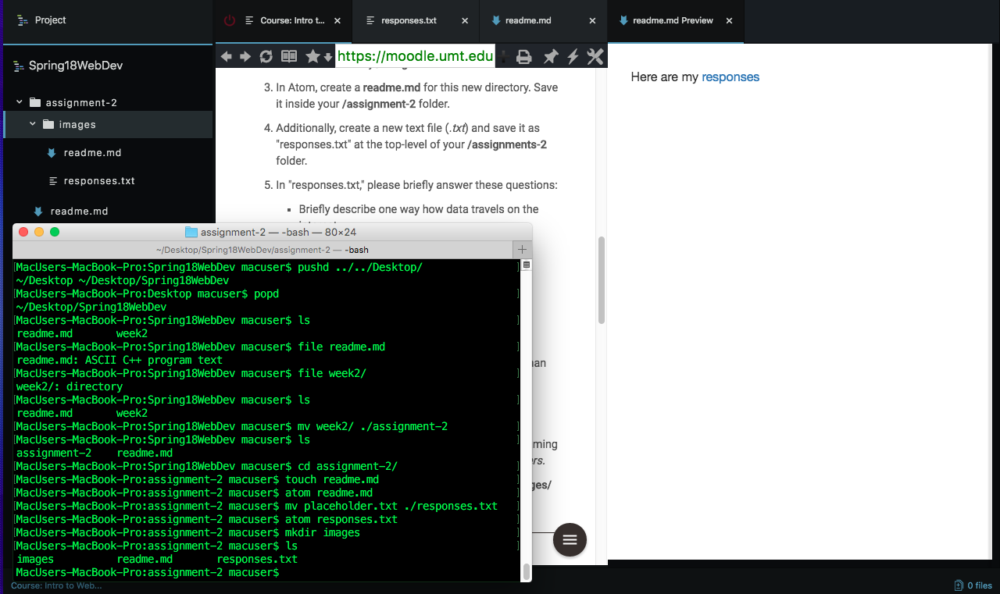

## Assignment 2

Alright, so here is my summary.
I am learning how to use markdown a bit better. Seems I should have payed more attention back in CC1. Though it seems to mostly be underscores, astrid and the scary **!-bang** symbol.

I did not have any issues with this weeks assignment. Throughout the week on my github explorations I will look if others post any issues.

So far so good.

Screenshot:

Here are my [responses](./responses.txt)
