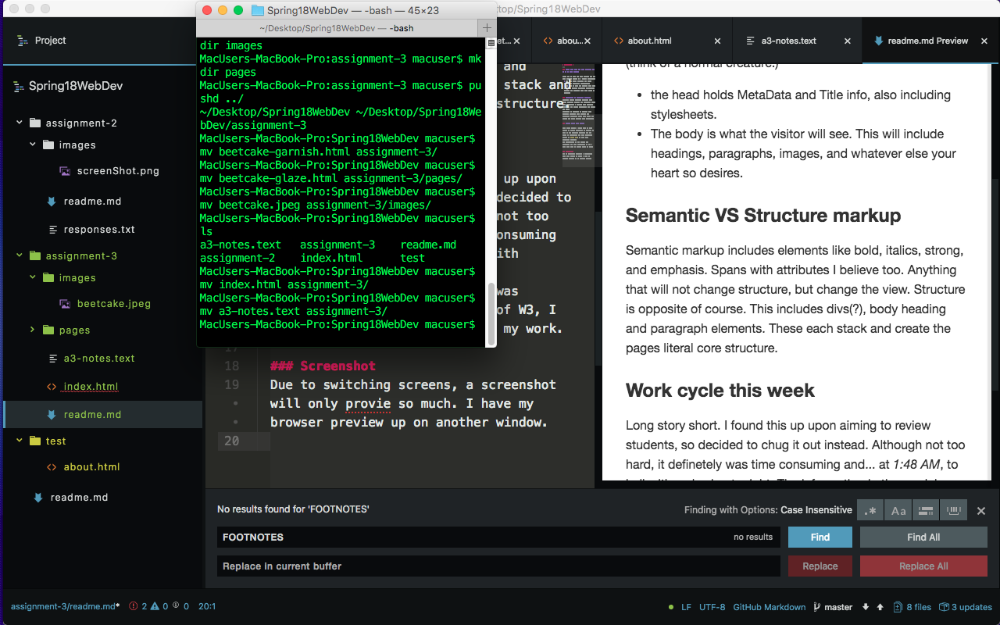

# Assignment 3
---
### **HOW MANY HEAD AND BODY ELEMENTS CAN BE ON AN HTML PAGE?**

There can be only one head element and one body element (think of a normal creature.)
  * the head holds MetaData and Title info, also including stylesheets.
  * The body is what the visitor will see. This will include headings, paragraphs, images, and whatever else your heart so desires.

### **Semantic VS Structure markup**
Semantic markup includes elements like bold, italics, strong, and emphasis. Spans with attributes I believe too. Anything that will not change structure, but change the view.
Structure is opposite of course. This includes divs(?), body heading and paragraph elements. These each stack and create the pages literal core structure.

### **Work cycle this week**

Long story short. I found this from initially logging in to moodle late at night, so decided to chug it out instead. Although not **too** hard, it definetely was time consuming and... at *1:48 AM*, to hell with other assignmentt.
The information in the module was thorough, and with assistance of W3 documentation, I am feeling more confident.

### Screenshot
Due to switching screens, a screenshot will only provide so much. I have a browser preview up on another window.

