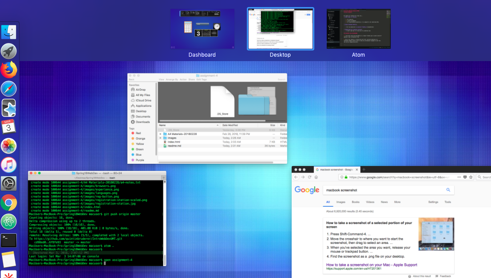

### ~~Will add Technical Report later~~
[Return to Main](../)

# Assignment 4: Forms and Tables

## What is "alt text," and why do we use it?

alt text is used for the process of image loading issues and visual impairment. This creates a tag that can be viewed when hovered.

### Describe any forms you've come across while browsing the web. What purposes do the serve?

Forms are everywhere. From the login page's of Facebook, Questionnaire experiences, and anything that tracks/stores user information.

### Summarize your work cycle for this assignment.
I assisted a student on the issues board, but did not post any issues. There is occasional typo, but was quickly found. Procrastination was the biggest struggle this week. Due to other things I needed to do, I would have minimal time in the night to complete.

