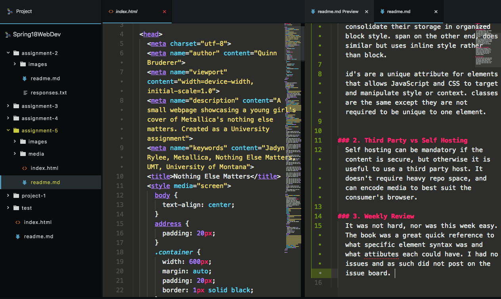

# Assignment 5

I will aim to keep this week's readme short and sweet.

### 1. Divs within Divs
  So the difference between a div element and a span element is that divs consolidate their storage in organized block style. span on the other end, does similar but uses inline style rather than block.

  id's are a unique attribute for elements that allows JavaScript and CSS to target and manipulate style or context. classes are the same except they are not required to be unique to one element.

### 2. Third Party vs Self Hosting
  Self hosting can be mandatory if the content is secure, but otherwise it is useful to use a third party host. It doesn't require heavy repo space, and can encode media to best suit the consumer's browser.

### 3. Weekly Review
  It was not hard, nor was this week easy. The book was a great quick reference to what specific element syntax was and what attibutes each could have. I had no issues and as such did not post on the issue board.

