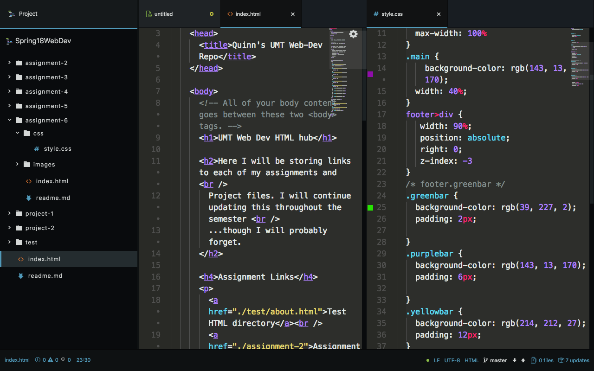

# Assignment 6
## Introduction to CSS

Man, oh man. CSS is both a great tool, as well as a nightmare. 
Coming from someone new to it, I understand the capabilities it has to offer, however it can be very confu#sing. 

### Design Process and Work Cycle
I did not spend too much time on Google, however I was able to find many fun color ideas for the 90s. A lot of technology, neon, and even psych. Afterwards, I looked at other students' projects and some of the examples from the website. I manipulated them in codepen, and then tried to start my own. I failed...for about 25 minutes. Finally I got my first box appearing on the screen, and from there, I swapped between screens, double checking my work. It was not easy done however, I still had to step away a couple times in irritation and anger. 

Though due to a [personal website](https://www.quintinbruderer.github.io/PortfolioWebsite) I have been working on, time was crunched. I understand the concepts of the different attributes to CSS, but object placement (relative/absolute) mixing with margin and padding had me cussing numerous times. 

In the design, I chose to use the big ol' 90s png, as well as the neon trees. With match to those, I added a couple accent bars in an overlay fashion, including purple, green, and yellow. All highly bright and saturated. 

