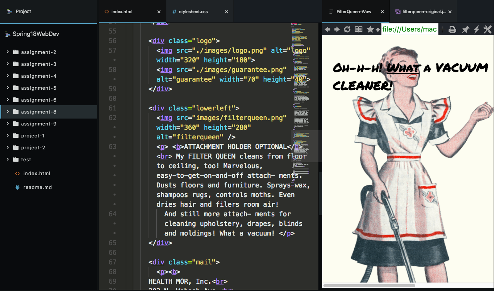

# Assignment 8
## Quinn Bruderer

Due to events of this week, I was unable to complete the assignment. However, I have sent Justine a link to my website I built for my portfolio.

## Padding Margin Borders
Padding further scales the specific elements size, allowing "breathing room" for the item itself.
A border runs outside of the element and padding, and creates a distinct separation of the element to the page. This can be styled.
Margin is similar to padding, however it does not scale the element. It gives breathing room to the element as a full to other elements in the page.

## Struggles
Styling as a full is very hard. I have learned fonts much better and I understand margin and padding much better. But the concept of the blocks within blocks besides blocks arrangement is a strong struggle.

## Process
After reading the materials, I proceeded to get my assets together. I searched for a similar font, and found. I gave classes to each div and separated them into duo blocks through the page. I started to style and realized just how far I had to go. I did look at some repos for assistance, however I wanted tof igure it out myself. So, I will continue to try, however other finals are calling my name.

