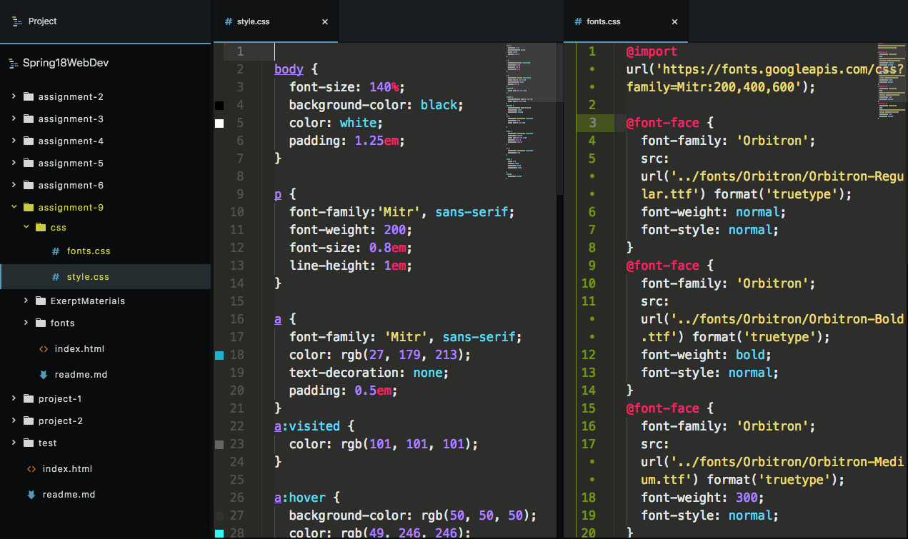

# Typography A9
### Quinn Bruderer

This week was a smooth week. It still took some time to do, however it was much more straightforward than the prior week with alignment.
I had some time searching through fonts and wanted something that looked aged, retro, and sharp as the main. And due to that, I wanted a round secondary font. I opted to maintain a Sans Serif style, as it invokes more technology feel.

#### What is the difference between a system font, web font, and web-safe font? What is the importance of having fallback fonts or a font stack?

A system font is a font that is installed onto the client/viewers computer.
A web font is a font that is hosted from the website that the computer needs to download. And due to different computer font styles, this can be tricky.
Web-Safe are fonts hosted by sources such as FontSquirrel and Google (of course). These are sourced through links and as the name says, web-safe for most all computers.

#### Summarize your work cycle for this assignment. Review this page if you need some ideas.

I initially started off viewing the difference exerpts. I was very torn between Atari and Rowling, but I could see much more with Atari. I then followed the instructions, which was pretty straight forward. I ended off on some minor "extras", adding a logo image, and a link to play.

#### Embed a screenshot of your workspace at some point during your development cycle.

