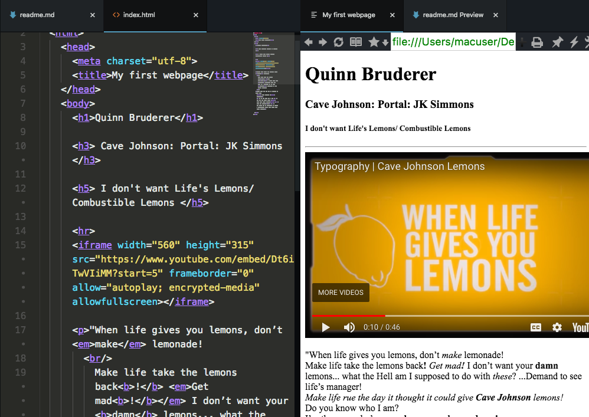

# Project 1
## Lemons: Lifes a "beach"

I noticed this was never pushed, so now this should work.

I do not fully remember my workflow for this. But I did enjoy the early attempt of using an iframe.

...and that typography is **stunning**.

## Web surfing
My primary browser is firefox. It has been what I have used for over a decade. I do not dislike chrome, but I support Mozilla as *"Chrome's Shaddow"*. When developing however, I use a fancy lil' browser package for Atom, and Chrome heavily; it has better dev tools.

## Good 'ol days

I remember viewing youtube and myspace. Finding a webpage outside of Google to view was not easy... the 90's were rough.
However, these sites all used very blocky and colorful markup...my favorite is the text flash.

## Work cycle
Well, I first got the barebones information on the page. Afterwards I started to fiddle with the strong and emphasis markup. Which after I decided I wanted to overachieve with the video.

...fast forward a month or so to realize I never pushed my readme. Shit...

