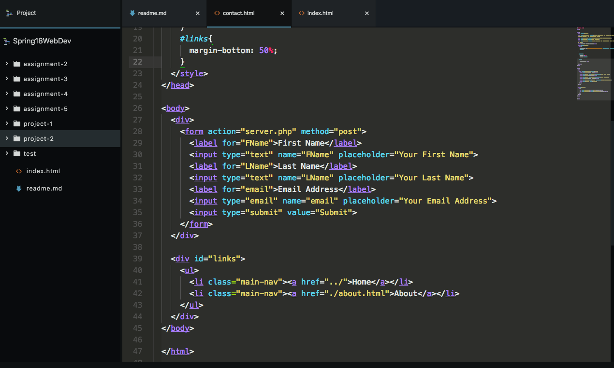

# Project 2

Man, what a bugger this project was.
I planned on completing it today, and somehow achieved, but there are some questions I have.

### Why is the form element inline?
I did some looking into this, and it is to be initially block styling. Scratching my head on this.
### How would I center align the iframe in About?

I tried multiple styling attributes to classes and the ID, but nothing seemed to properly work.

## Did I help anyone?
At this early time of the week, I have not yet seen any issues beyond my own. I will keep eyes upon the issues.

## How did'ja do it?

Luckily I had the Jon Duckett book close beside for reference. But as what seems to be a programming normal, Google is a very close friend. I looked up syntax on *w3*, which also helped massively.

If you have any code samples that may be able to help me fix my earlier problems, that would be greatly appreciated.

